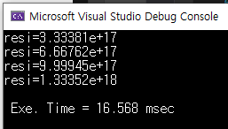
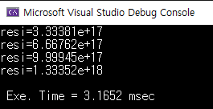
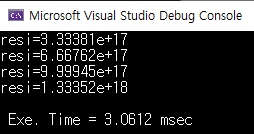

# parallel-programming

## practice 2

현재 사용하고 있는 쓰레드의 개수를 출력한다.

## practice 3

정적 데이터 병렬화로 2차원 행렬을 만든다.

## practice 4

병렬 버블 정렬을 구현한다. 병렬 프로그래밍을 함으로써 인접한 두 데이터간 의존성 충돌이 발생할 수 있는데 홀수와 짝수 단계를 나누어서 의존성 문제를 해결하여 병렬 버블 정렬을 구현할 수 있다.

## practice 5

두 배열의 내적을 Reduction을 이용하여 연산한다. 쓰레드의 개수와 배열 사이즈를 변경했을 때 실행시간의 차이를 알아볼 수 있다.

### 1. 배열 사이즈 1,000

### 2. 배열 사이즈 100,000,000

### 결과 분석
배열의 사이즈가 100,000,000일 때 싱글 쓰레드 환경에서 평균 계산 시간은 0.51초로 가장 느렸고 쓰레드의 개수가 많아질수록 계산 결과가 빨라지는 것을 확인할 수 있다. 쓰레드의 개수가 2배 늘어나면 계산 시간 또한 반대로 약 1/2배로 줄어드는 것을 확인할 수 있다.
반대로 사이즈가 작은 배열의 경우 병렬 프로그래밍을 통해서 유의미한 결과를 얻지 못했다. 배열의 사이즈가 충분히 크지 않기 때문에 연산에 걸리는 시간보다 병렬 프로그래밍을 함으로써 발생하는 오버헤드가 더 크기 때문인 걸로 추측한다.

## practice 6

암시적 배리어 및 실행되는 스레드의 순서를 지정할 수 있다.

## practice 7

omp barrier, nowait, atomic, critical 예제를 통해 동기화 문제를 해결할 수 있다.

## practice 8

메모리간 가짜 공유(false sharing)가 발생하여 캐시 미스가 나는 문제를 확인하고 해결방법 구현. 같은 8,000 X 8,000 2차원 배열에 행 단위로 값에 접근할 때보다 열 단위로 접근했을 때 성능이 더 안 좋은 것을 확인할 수 있다.

### 해결 방법 1: 지역 변수 활용

지역 변수에 값을 저장하고 제일 마지막에 최종 결과에 반영한다. 마지막에만 false sharing이 발생하기 때문에 성능을 크게 향상 시킬 수 있다.

### 해결 방법2: 더미 데이터 활용

결과값을 저장하는 배열을 크게 만들어서 다른 스레드끼리 같은 캐시라인을 공유하지 않도록 한다.

두 해결방법 모두 약 5배 정도 빨라진 것을 확인할 수 있다.

