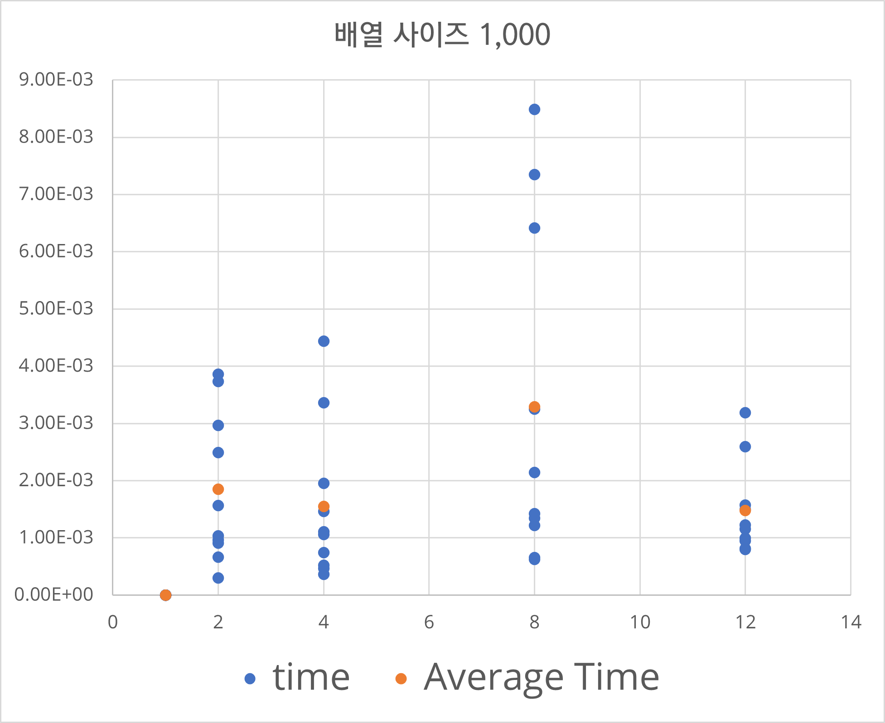
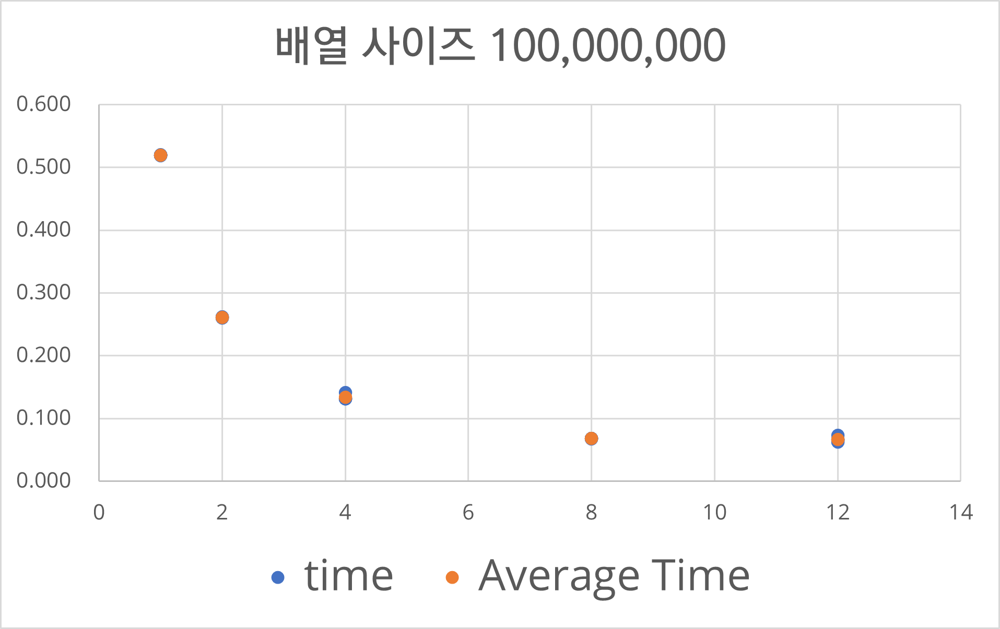

# parallel-programming

## practice 2

## practice 3

## practice 4

## practice 5

두 배열의 내적을 Reduction을 이용하여 연산한다. 쓰레드의 개수와 배열 사이즈를 변경했을 때 실행시간의 차이를 알아보자.

### 1. 배열 사이즈 1,000

### 2. 배열 사이즈 100,000,000

### 결과 분석
배열의 사이즈가 100,000,000일 때 싱글 쓰레드 환경에서 평균 계산 시간은 0.51초로 가장 느렸고 쓰레드의 개수가 많아질수록 계산 결과가 빨라지는 것을 확인할 수 있다. 쓰레드의 개수가 2배 늘어나면 계산 시간 또한 반대로 약 1/2배로 줄어드는 것을 확인할 수 있다.
반대로 사이즈가 작은 배열의 경우 병렬 프로그래밍을 통해서 유의미한 결과를 얻지 못했다. 배열의 사이즈가 충분히 크지 않기 때문에 연산에 걸리는 시간보다 병렬 프로그래밍을 함으로써 발생하는 오버헤드가 더 크기 때문인 걸로 추측한다.
